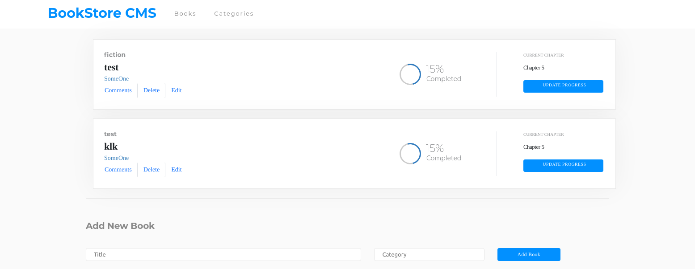

# Bookstore

> This is a SPA in which you find and read Books

## Built With

- React/JS
- Redux
- HTML & CSS
# Screenshot

## Live Demo

[Live Demo Link](https://awesome-easley-c7d004.netlify.app/)

### Setup

To get a local copy up and running follow these simple example steps.

Click [here](https://github.com/2bleO/bookstore) to go to the repo and clone the project by opening your terminal and entering "git clone" + "The link supplied".

cd into the repo by typing
$ cd ./your-path/bookstore/

$ git checkout feature/components

$ npm install

$ npm start

## Authors

👤 **Onesis Olea**

Github: @2bleO

Twitter: @OleaOnesis

LinkedIn: Onesis Olea

## 🤝 Contributing

Contributions, issues, and feature requests are welcome!

Feel free to check the [issues page](https://github.com/2bleO/bookstore/issues).

## Show your support

Give a ⭐️ if you like this project!

## 📝 License

This project is [MIT](https://opensource.org/licenses/MIT) licensed.